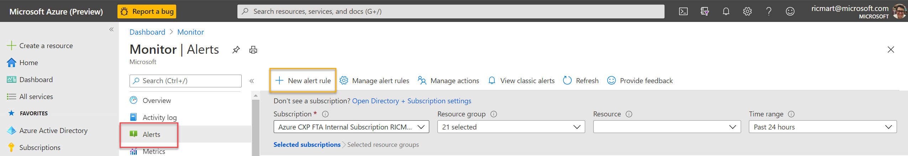
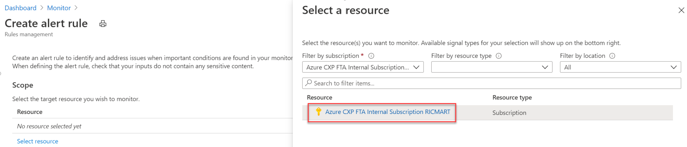
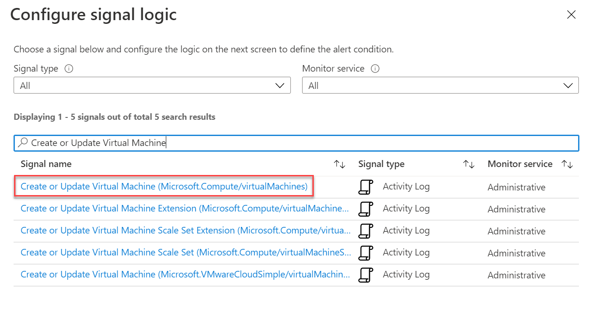
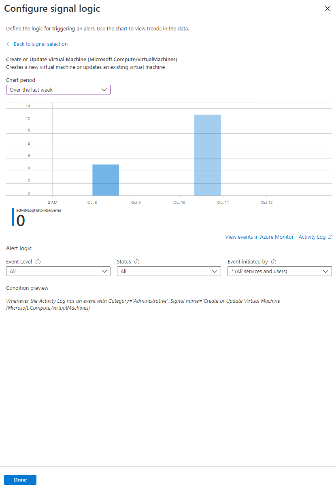
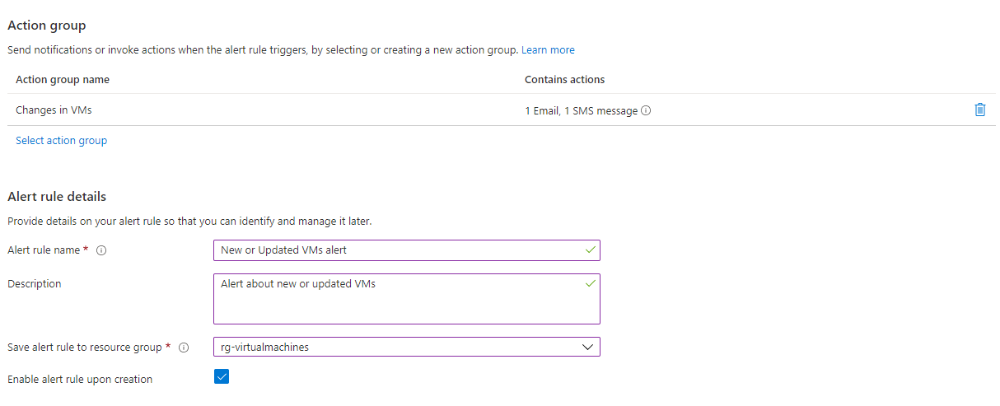
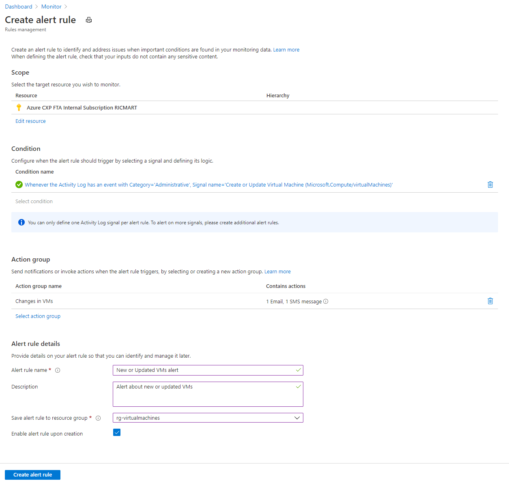
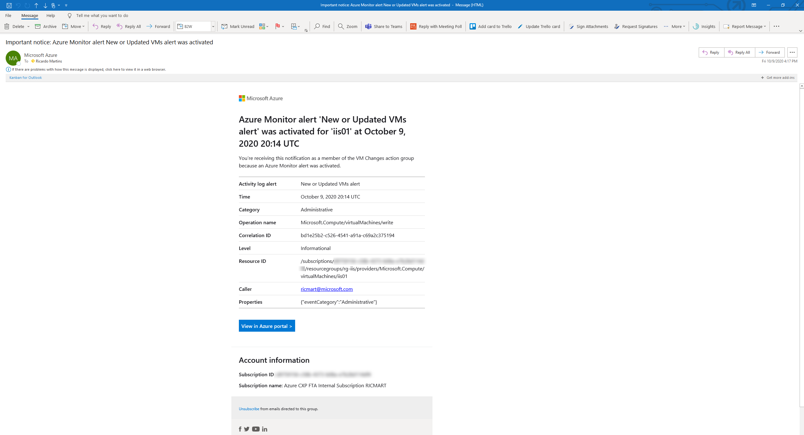

# Being alerted about creation or updates of Virtual Machines in your Azure Subscription

In this document, I'll show you how to be alerted when a VM is created or updated inside your Azure environment. Please note that updated means started, stopped, restarted, have their size or any characteristic changed.

To do this, we will be using the [Azure Activity Logs](https://docs.microsoft.com/en-us/azure/azure-monitor/platform/activity-log) that is part of the [Azure platform logs](https://docs.microsoft.com/en-us/azure/azure-monitor/platform/platform-logs-overview) and provides insights into subscription-level events.

Just as a reminder, please note that the Azure Activity Logs are enabled by default and stored in the Azure platform for 90 days. If  you want to have retained from more than 90 days, you should configure to [send the data to a Log Analytics Workspace](https://docs.microsoft.com/en-us/azure/azure-monitor/platform/activity-log#send-to-log-analytics-workspace) if you want enable features of [Azure Monitor Logs](https://docs.microsoft.com/en-us/azure/azure-monitor/platform/data-platform-logs), [to Event Hubs](https://docs.microsoft.com/en-us/azure/azure-monitor/platform/activity-log#send-to-azure-event-hubs) if you want to send the data outside of Azure or [to Azure Storage](https://docs.microsoft.com/en-us/azure/azure-monitor/platform/activity-log#send-to--azure-storage)  if you want to retain the log data for audit, static analysis or backup.

1. First of all, ensure you are [sending the Activity Logs to a Log Analytics Workspace](https://docs.microsoft.com/en-us/azure/azure-monitor/learn/quick-collect-activity-log-portal). 

2. Then go to the Azure Monitor > Alerts and click to + New alert rule

3. Select your subscription as Scope:

Please note that for the purpose of this document we will be monitoring the entire subscription. But if you want, you can filter by resource type and/or location and monitor only a specific resource group/resource/location.

4. In Condition search by "Create or update Virtual Machine" then select the first result:

Note that you can search for different options to see other  alternatives available. Just as example, if you want be alerted only for added VMs, you can filter by "Add Virtual Machines".

5. In the second screen that will show-up, choose the Chart period then click Done:

6. Now set the [Action group](https://docs.microsoft.com/en-us/azure/azure-monitor/platform/action-groups) and the [Alert rule details](https://docs.microsoft.com/en-us/azure/azure-monitor/platform/alerts-log) then click to Create alert rule:

7. If everything is ok, you may have something like this:

8. Now, when a new VM is created or changed into your subscription, you will receive those kind of alerts by e-mail:

    
  
